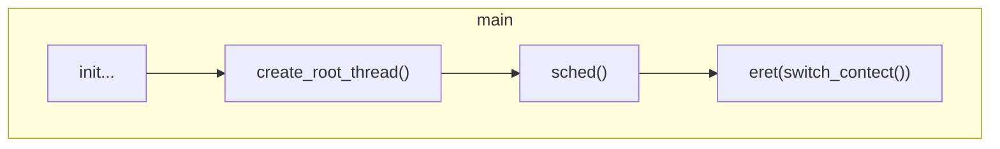
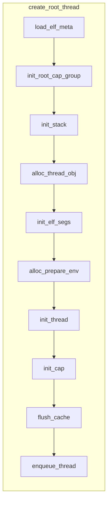
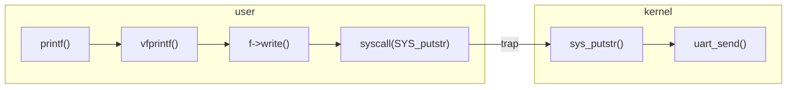

# 实验记录

## init_thread_ctx

线程上下文的初始化需要记录以下内容：
1. `SP_EL0`: 指向用户栈顶
2. `ELR_EL1`: 指向用户程序入口地址
3. `SPSR_EL1`: 设置为 `0`，表示从 EL1 切换到 EL0 时，使用 `EL0t` 模式
4. 设置为线程状态为 `INIT`
5. 设置线程类型 (`USER`/`SHADOW`/`REGISTER`/`TRACEE`, 详见 `kernel/include/sched/sched.h`)
6. 设置线程亲和性，budget，priority 等调度相关信息
7. 设置线程内核栈状态，退出状态

# 思考题

> 思考内核从完成必要的初始化到第一次切换到用户态程序的过程是怎么样的？尝试描述一下调用关系。
{: prompt-info}

调用关系大致如下：



可以看到，初始化后内核主要做了三件事：
1. 创建第一个根线程
2. 调用调度器
3. 用 EL1 切换回用户态

我们主要关注创建根线程的过程：



该函数主要做了几件事：
1. 读取 ELF 文件元信息
2. 创建并初始化根能力组，并根据 cap 获取 vmspace 内核对象，后续 VMR 和 PMO 的映射都是基于该 vmspace 进行的
4. 创建用户栈对应的 PMO 和 VMR
5. 创建线程内核对象
6. 根据元信息初始化 ELF 的各个段，并创建对应的 PMO 和 VMR 及映射
7. 完成 vmspace 的初始化后，放回到对应 slot 中
7. 创建并初始化用户态运行环境
8. 初始化线程，并将线程内核对象放到根能力组的 slot 中
9. flush cache 并将线程放入调度器的就绪队列

> 尝试描述 `printf` 如何调用到 `chcore_stdout_write` 函数。
{: prompt-info}

大致的调用关系如下：


在 ChCore 中，输出流是以文件描述符的形式存在，因此 `f->write` 实际上调用的是 `stdout` 的对应的 `write` 函数:

```c
struct fd_ops stdout_ops = {
        .read = chcore_stdio_read,
        .write = chcore_stdout_write,
        .close = chcore_stdout_close,
        .poll = chcore_stdio_poll,
        .ioctl = chcore_stdio_ioctl,
        .fcntl = chcore_stdio_fcntl,
};
```

可以看到 `stdout->write()` 实际上就是调用的 `chcore_stdout_write` 函数。