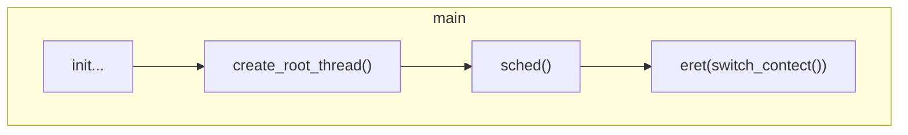
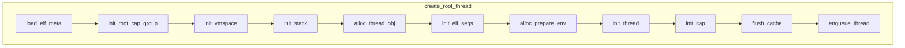

# 实验记录

# 思考题

> 思考内核从完成必要的初始化到第一次切换到用户态程序的过程是怎么样的？尝试描述一下调用关系。
{: prompt-info}

调用关系大致如下：

```mermaid
graph LR
    subgraph main
    direction LR
    init[init...] --> callNode["create_root_thread()"] --> sched["sched()"] --> eret["eret(switch_contect())"]
    end 
```

可以看到，初始化后内核主要做了三件事：
1. 创建第一个根线程
2. 调用调度器
3. 用 EL1 切换回用户态

我们主要关注创建根线程的过程：

```mermaid
graph LR
    subgraph create_root_thread
    direction LR
    load_elf_meta --> init_root_cap_group --> init_vmspace --> init_stack --> alloc_thread_obj --> init_elf_segs --> alloc_prepare_env --> init_thread --> init_cap --> flush_cache --> enqueue_thread
    end 
```