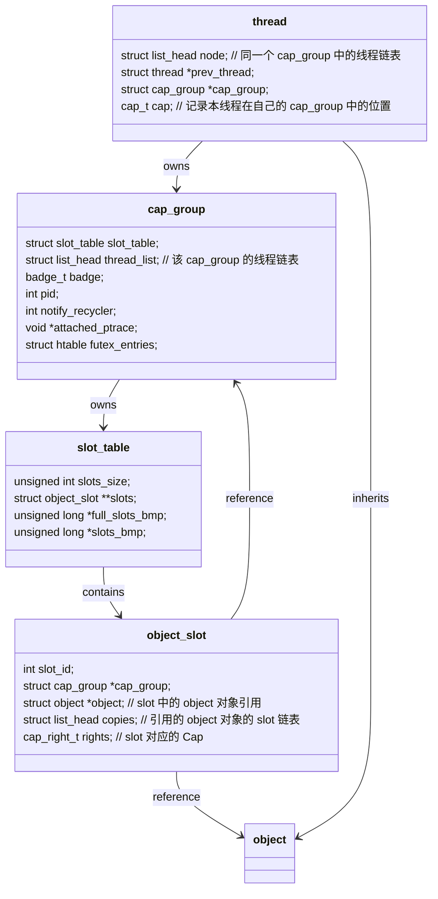

# ChCore 学习笔记

## 概览

本 note 为个人学习 ChCore 中的一些笔记，内容主要参考 ChCore 源码和实验指导书，并结合个人理解进行整理，内容难免有误，欢迎指正

> 本 note 不包含 Lab 任务内容，实验实现请参考 Lab Report 以及[个人实现](https://github.com/Bouncyyyy/SJTU-ChCore-Impl)

## 内核启动

启动部分只能用纯汇编实现，因为此时 C 语言依赖的栈等语境还未就绪

在 QEMU 中，kernel 映像文件被 bootloader 加载到内存后，内核会从预先设置好的地址开始执行，在 ChCore 中即为 `_start` 函数(0x80000)

> **启动地址的设置**
>
> TODO
{: .block}

### Primary_init

多核环境下，多个 CPU 同时进行内核初始化会导致对一些共享数据的数据竞争，因此 ChCore 只允许 0 号核进行主初始化，其他核轮询直到 0 号核完成了必要的初始化

> **控制 CPU 启动行为**
> `_start` 开头有这么一段：
> ```nasm
> BEGIN_FUNC(_start)
>   mrs x8, mpidr_el1
>   and x8, x8, #0xFF
>   cbz x8, primary
>   ...
> ```
> 这里很明显，是对 `primary_init` 的逻辑控制，rtfm 后可以得到，`mpidr_el1` 低八位存储的是 CPU 的唯一标识，这样，我们可以通过判断 CPU ID 来决定当前核是否为 0 号核
{: .block}

`init_c` 是主要初始化函数，代码如下：
```c
void init_c(void) {
	clear_bss();
	early_uart_init();
	wakeup_other_cores();
	init_kernel_pt();
	el1_mmu_activate();
	start_kernel(secondary_boot_flag);
}
```
该函数主要完成了以下工作：
1. 清空 bss 段
2. UART 串口初始化
3. 初始化内核页表
4. 启用 MMU
5. 通知其他核并进入 `kernel_main`

`start_kernel` 主要做了以下工作：
1. 分配内核 C 需要的栈，设置 EL1 低地址空间页表基址寄存器 `ttbr0_el1`
2. 跳转到 `main` 函数，启动内核并将 `secondary_boot_flag` 传递给 `main`

### Secondary_init

TODO

## 内存管理

ChCore 的内存管理主要分为两个部分：物理内存和虚拟内存

Buddy + Slab 管理物理内存以及页表管理虚拟内存的机制不过多赘述

ChCore 将虚拟内存和物理内存进一步抽象为了一系列内核对象：一个进程的**虚拟空间** (vmspace) 是由多段**虚拟内存段** (VMR/VMA, vmregion) 构成，每一段虚拟内存段都对应一个**物理内存对象**(PMO)，PMO 记录了物理地址的相关信息。系统实际上管理的是这些抽象后的内核对象而非物理页和虚拟页

## 基于 Capability 的资源管理

ChCore 将所有系统资源都抽象成**对象**（object），可以理解成：系统中的 vmspace, pmo, thread 等等资源都继承自 object 类，ChCore 通过**能力组机制**管理所有的系统资源，在代码中体现为: 能力组本身只是一个指向 Object 的指针的数组

Cap 是一种**按需授权**机制，作为线程/进程的属性存在，在执行特权操作时，内核会检查当前 Cap 判断是否允许该操作

### 能力 & 能力组

ChCore 对内核对象、能力、能力组有如下要求：
1. 所有进程/线程都拥有独立的能力组，并拥有一个全局唯一的 ID (**Badge**)
2. 所有对象（包括进程或能力组本身）都属于一个或多个能力组当中：
    - 子进程/线程将属于父进程的能力组中
    - 某个能力组的对象拥有该能力组内的能力 ID (**cap**)
3. 对象可以在多个能力组中共享，也可以在不同的能力组中拥有不同的 cap
4. 使用引用计数跟踪所有对象的取用和返还。内核 GC 会自动回收无引用对象
5. cap 具有权限，表明该能力能否被共享（`CAP_RIGHT_COPY`）以及能否被删除（`CAP_RIGHT_REVOKE`）

Cap 的理解比较抽象，源码中对 Cap 的注释是这样描述的：
```plain
/*
 * Rights of capabilities.
 * Rights can be divided into two types, one is object-specific rights (such
 * as PMO_READ, PMO_WRITE, PMO_EXEC, PMO_COW), and the other is some general
 * rights (CAP_RIGHT_COPY and CAP_RIGHT_REVOKE_ALL) to define capability
 * actions.
 * NOTE: When defining new capability rights, it is necessary to be careful
 * NOT to cause CONFLICTS between the above two types of rights.
 */
```

Cap 分为两个方面：
1. 内核对象的具体权限，比如 `PMO_READ`, `PMO_WRITE`, `PMO_EXEC`, `PMO_COW`
2. 一些通用权限，比如 `CAP_RIGHT_COPY` 和 `CAP_RIGHT_REVOKE_ALL`

我们可以梳理一下 Cap 相关的 hierarchy(删去了不相关的成员和锁):


### 能力组的创建

在启动时（`main` 函数中），内核调用 `create_root_thread` , 并该函数中通过 `create_root_cap_group` 创建第一个 `cap_group` 进程，并在 `root_cap_group` 中创建第一个线程

除此之外，用户程序可以通过 `sys_create_cap_group` 系统调用创建新的 `cap_group`

#### 根能力组的创建
```c
/* This is for creating the first (init) user process. */
struct cap_group *create_root_cap_group(char *name, size_t name_len) {
    struct cap_group *cap_group = NULL;
    struct vmspace *vmspace = NULL;
    cap_t slot_id;

    cap_group = (struct cap_group*)obj_alloc(TYPE_CAP_GROUP, sizeof(struct cap_group));
    BUG_ON(!cap_group);

    /* initialize cap group with common, use ROOT_CAP_GROUP_BADGE */
    BUG_ON(cap_group_init_common(cap_group, BASE_OBJECT_NUM, ROOT_CAP_GROUP_BADGE));
    
    slot_id = cap_alloc(cap_group, cap_group);
    BUG_ON(slot_id != CAP_GROUP_OBJ_ID);

    vmspace = (struct vmspace*)obj_alloc(TYPE_VMSPACE, sizeof(struct vmspace));
    BUG_ON(!vmspace);

    /* fixed PCID 1 for root process, PCID 0 is not used. */
    vmspace_init(vmspace, ROOT_PROCESS_PCID);

    slot_id = cap_alloc(cap_group, vmspace);
    BUG_ON(slot_id != VMSPACE_OBJ_ID);

    /* Set the cap_group_name (process_name) for easing debugging */
    memset(cap_group->cap_group_name, 0, MAX_GROUP_NAME_LEN + 1);
    if (name_len > MAX_GROUP_NAME_LEN)
        name_len = MAX_GROUP_NAME_LEN;
    memcpy(cap_group->cap_group_name, name, name_len);

    root_cap_group = cap_group;
    return cap_group;
}
```
根 `cap_group` 的创建主要分为几步：
1. 申请一个 `cap_group` 对象
2. 初始化能力组，并分配 `ROOT_CAP_GROUP_BADGE` 作为其 badge
3. 根能力组的第一个 slot 为能力组对象本身
4. 根能力组的第二个 slot 为该能力组对应的 `vmspace` 对象

#### 用户能力组的创建
```c
cap_t sys_create_cap_group(unsigned long cap_group_args_p) {
    struct cap_group *new_cap_group;
    struct vmspace *vmspace;
    cap_t cap;
    int r;
    struct cap_group_args args = {0};

    r = hook_sys_create_cap_group(cap_group_args_p);
    if (r != 0) return r;

    if (check_user_addr_range((vaddr_t)cap_group_args_p,
                              sizeof(struct cap_group_args)) != 0)
        return -EINVAL;

    r = copy_from_user(&args, (void *)cap_group_args_p,
                       sizeof(struct cap_group_args));
    if (r) return -EINVAL;

    /* cap current cap_group */
    /* Allocate a new cap_group object */
    new_cap_group = 
        (struct cap_group *)obj_alloc(TYPE_CAP_GROUP, sizeof(struct cap_group));
    if (!new_cap_group) {
        r = -ENOMEM;
        goto out_fail;
    }
    /* initialize cap group from user*/
    BUG_ON(cap_group_init_user(new_cap_group, BASE_OBJECT_NUM, &args));

    cap = cap_alloc(current_cap_group, new_cap_group);
    if (cap < 0) {
        r = cap;
        goto out_free_obj_new_grp;
    }

    /* 1st cap is cap_group */
    if (cap_copy(current_thread->cap_group, new_cap_group, cap,
                 CAP_RIGHT_NO_RIGHTS,
                 CAP_RIGHT_NO_RIGHTS) != CAP_GROUP_OBJ_ID) {
        kwarn("%s: cap_copy fails or cap[0] is not cap_group\n", __func__);
        r = -ECAPBILITY;
        goto out_free_cap_grp_current;
    }

    /* 2st cap is vmspace */
    vmspace = (struct vmspace *)obj_alloc(TYPE_VMSPACE, sizeof(struct vmspace));
    if (!vmspace) {
        r = -ENOMEM;
        goto out_free_obj_vmspace;
    }

    vmspace_init(vmspace, args.pcid);
    r = cap_alloc(new_cap_group, vmspace);
    if (r != VMSPACE_OBJ_ID) {
        kwarn("%s: cap_copy fails or cap[1] is not vmspace\n", __func__);
        r = -ECAPBILITY;
        goto out_free_obj_vmspace;
    }

    return cap;
out_free_obj_vmspace:
    obj_free(vmspace);
out_free_cap_grp_current:
    cap_free(current_cap_group, cap);
    new_cap_group = NULL;
out_free_obj_new_grp:
    obj_free(new_cap_group);
out_fail:
    return r;
}
```

`sys_create_cap_group` 是作为系统调用的 handler 呈现给用户程序, 接受一个参数 `cap_group_args_p`，实际上是用户态进程传递过来的，在其地址空间中指向该 syscall 中**这个参数的指针**

这一点理解可以帮助我们理解 `sys_create_cap_group` 的主要流程：
1. 检查用户态指针的合法性
2. 从用户态拷贝参数到内核态
3. 类似根能力组的创建，申请一个新的 `cap_group` 对象，并初始化
4. 不同的是，新的 `cap_group` 的第一个 slot 指向当前的父能力组, 且 Badge 由内核分配


## 系统服务

在 ChCore 中，除了基础功能, （e.g. 线程切换，物理/虚拟内存管理，IPC），其他的系统服务都是以用户态进程的形式存在的。

### ProcMgr

ProcMgr 是一个自包含的 `ELF` 程序。其构建依赖于：
1. **fsm**：文件系统管理器，用于桥接不同挂载点上的文件系统的实现
2. **tmpfs**：ChCore 的根文件系统

# ChCore 编译流程

TODO
