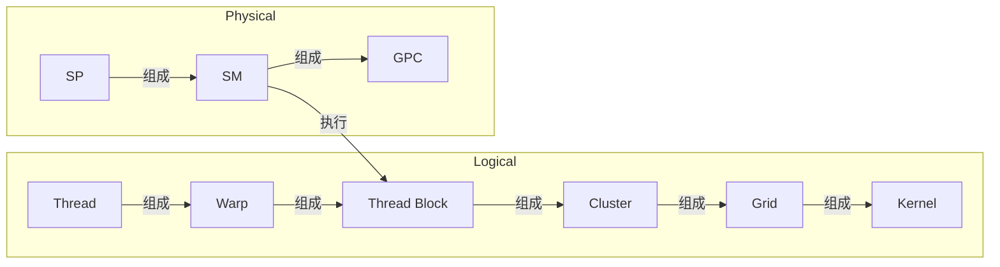

# GPU 学习笔记

## 概览

本 note 为国科大 2026 年秋《GPU 架构与编程》的一些笔记，内容涉及个人理解，内容难免有误，欢迎指正

## Programming Model

GPU 的几个关键概念之间的关系如下：

### From Thread To Kernel
围绕一个简单的例子展开：
```c++
__global__ void add(float* a, float* b, float* c) {
    int i = blockIdx.x * blockDim.x + threadIdx.x;
    c[i] = a[i] + b[i];
}
```
`add` 定义了一个 kernel，kernel 实际上描述每个 thread 的执行逻辑：
- 每个 thread 有自己的 `threadIdx.x` 用于计算内存地址和控制决策

```c++
add<<<1000, 256>>>(a, b, c);
```
这是一个 grid，grid 实例化一个 kernel，包括：
- 输入
- 包含多少个 block（in this case 1000）
- 每个 block 包含多少个 thread（in this case 256）

因此一个 grid 是由**程序同质、数据异质**的 threads 构成的并行执行空间

### Warp
gpu 不可能直接管理大量的 threads，为了降低调度和管理成本，NVIDIA GPU 将 32 个 thread 组织为 warp

warp 是硬件层面调度和执行的基本单元，同一 warp 内的 threads 采用 SIMT 范式，即 warp 内的 threads 执行在不同的数据上，执行相同的指令


> **Warp Divergence**
> ```c++
> if (threadIdx.x % 2 == 0)
    foo();
else
    bar();
> ```
> 对于上述 kernel，同一个 warp 内不同的 thread 执行不同的分支，但是由于同一时刻 warp 内的 thread 执行同一条命令，因此实际上的逻辑分为两步：
> 1. 偶数编号 thread 一起执行 `foo`
> 2. 奇数编号 thread 一起执行 `bar`
> 
> 同一时刻只有一般的 thread 正在工作，因此实际效率减半
{: .block}


Thread Block 将数个可以高效协作的 thread 组合，构成基本的逻辑单元：
- block 中的 threads 可以同步，通过 shared mem 进行通信
- thread block 是 SM 调度的基本单元，一个 block 的所有 threads 运行在同一个 SM 中

同一个 grid 中的 blocks 具有相同的 size 和 dimension
模型不对 blocks 之间的调度顺序作任何保证，因此 blocks